# 南京大学计算机考研408+845科目资料合集

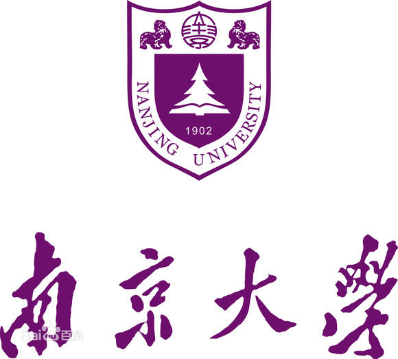</img>

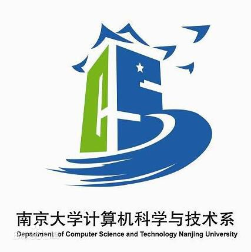

<font size="10">使用本仓库请完整的阅读本文档</font>

如果内容显示异常，可以查看<a href="https://feater.top/book/collections-of-njucs-postgraduate-examination-845-408">此处</a>

***资料包括：***

```
数学一、英语一、政治、数据结构、计算机网络、计算机组成原理、操作系统、计算机系统基础
包括真题、期末考试、PPT、模拟题、专业课参考书及课后答案、报录比、经验等等
845真题
408真题及参考答案
录取信息（报录比、录取人数、官方发布信息）
初试复试经验
公共课资料
专业课复习资料和思维导图
参考书目配套PPT
参考书目课后习题参考答案
期末考试文档
模拟题文档
```

***PS:只是整合，所以有的资料上面会有其他机构、论坛、公众号的广告。***

## 1.1. 友情链接

### 1.1.1. 计算机考研，这样选学校才是正解

***扫盲：正式复习之前可以看看***

https://blog.csdn.net/harvic880925/article/details/103193905

### 1.1.2. 刷了几千道算法题，这些我私藏的刷题网站都在这里了！

***算法、上机等等可以看看这个***

https://blog.csdn.net/u013486414/article/details/102961171

### 1.1.3. CS AI 仓库

https://github.com/nju-kaoyan/nju_csai_kaoyan

### 1.1.4. 复试经验贴

https://github.com/ThyrixYang/nju_cs_kaoyan_19/wiki

### 1.1.5. 其他教程

可以考虑到知乎（注意言辞，容易禁言封号）上面或者王道论坛上面看看有没有喜欢的资料

你考研的时候是怎么查找资料的？

`https://www.zhihu.com/question/303896489`

2020考研各科该买什么书？

`https://www.zhihu.com/question/309601783`

你考研的时候是怎么查找资料的？

`https://www.zhihu.com/question/303896489`

以及其他的问题比如：<a href="https://www.zhihu.com/question/306740247/answer/830478473">李林2019考研押题压中了多少？ - 一江春水向东流的回答 - 知乎</a>

## 1.2. 说明

- 原南京大学计算机科学与技术考研科目代码为845（数据结构、操作系统、计算机系统基础、计算机网络），但是2020年发布的招生目录中显示考研科目代码为408（数据结构、计算机网络、操作系统、计算机组成原理）。

- 原仓库是针对845的，改为408后不想删除原仓库就有了此仓库。

- <font color=red>所有资料收集自网络</font>

- 本仓库所有内容仅供参考，其真实性、有效性等请自行判断。

- 本仓库所有内容完全免费，但是有的资料会有水印。首先保持没有水印，其次在能分辨内容的情况下使用带水印的资料。

- 如果有看不清，或者其他原因导致资料使用过程中出现问题的，欢迎通知我。

- 根据pandownload事件不提供网盘地址。

- 王道书在B站有官方的教学视频

- 如果阁下想添加资料至本仓库，请遵循以下原则：

(1) 无法上传至仓库的资料必须完全免费，比如说B站的视频、没有版权需要自己处理的PDF、在线微课等等；

(2) 优先考虑没有水印，或者水印较少的资料。如果没有其他选择，可以上传带水印或者不清晰的资料；

(3) 暂时还没有想到，因为除了我还没有人添加资料。

## 1.3. 下载地址

<font color="red" size="10">当前仓库大小为1.5GB，内容大小为</a>

1、一些资料可以在github中搜索，很多，很方便

2、github.com下载

```bash
git clone https://github.com/JackeyLea/NJUCS --depth 1
```

3、码云下载（无效）

码云仓库最大为1G，已删除

4、coding下载（无效）

coding.net仓库大小限制为1G，仓库已删除。

5、csdn下载

csdn的git仓库目前可用。

```bash
git clone https://gitcode.net/mirrors/JackeyLea/NJUCS.git
```

## 1.4. 联系方式

作者：幽弥狂

邮箱：1768478912@qq.com

QQ：1768478912 （往事深处的少年）

交流群：550150534

你可以在QQ找到的计算机/考研/南京大学交流群我都加过，基本上没什么卵用（建议大家不要在这个上面花费太多的时间，当然了，你想没事水水群的话另说）。

这个群是我迄今为止见到最好的，其他群里面有价值的资料我都盗下来了。

可以看到，内容基本上都一样。

所谓的内部资料基本上没有，而且王道论坛、百度网盘等等都可以找到。

某宝、某鱼上面的资料不建议买，还不如多看看做做参考书目课后习题。

当然了，只是建议，说的不对，你不想听也不要顺着网线过来打我。

</img>

不是我的群，我又无权管理，阁下酌情处理。

仓库内容随缘更新

***交流群是在别人经验里看来的，考虑到维护一个群的时间和经验，使用别人的现有群。按照群的要求，不许灌水，只能进行专业交流，如果有兴趣，可以考虑考虑***

群主授权

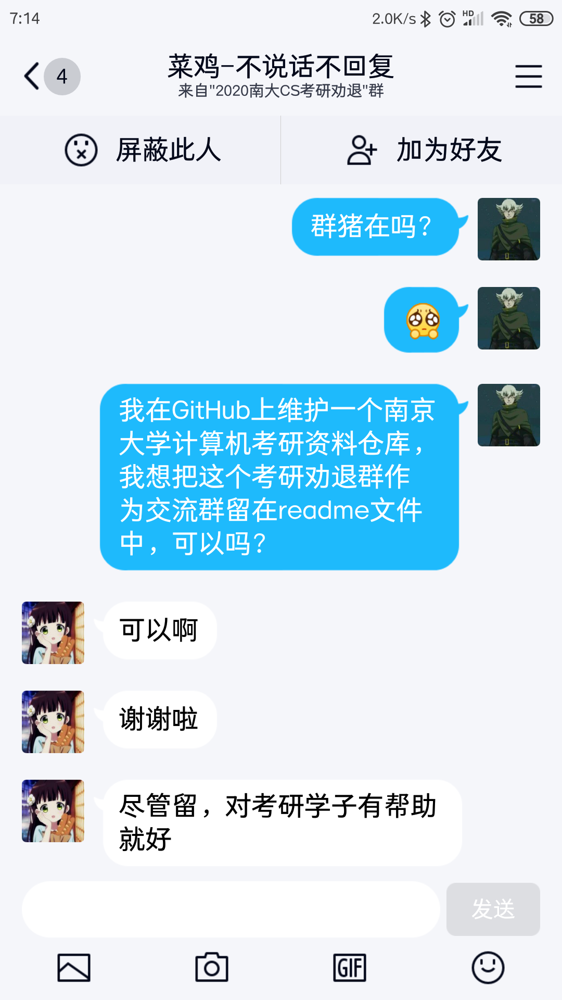

如果觉得考研太难就放弃吧，人生苦短，及时行乐。

**如果有任何版权或者其他问题，欢迎联系我，我会尽快解决**

## 1.5. 黑名单

## 1.6. 考试相关

### 1.6.1. 考试时间线

***2020年***

***研究生招生网站：https://yz.chsi.com.cn/***

#### 1.6.1.1. 咨询周

2020年9月19日至9月23日,可以在研招网咨询对应学校的老师.

#### 1.6.1.2. 预报名

2020年9月24日至9月27日，每天9:00~22:00

***报名时备用信息无明确要求***

#### 1.6.1.3. 网上报名

2020年10月10日至10月31日,每天9:00-22:00

报名是注意报名地的要求，不要像我一样报完名发现无法确认报名。

提示：苏州地区的考生要8/9/10月的社保记录才能在苏州报名考试。

#### 1.6.1.4. 现场确认

由省级招生办公布，苏州是网上确认，2019年时间为2019年11月10-11左右

#### 1.6.1.5. 下载准考证

2020年12月19日至2019年12月28日（24小时开放）,考生在研招网自行下载准考证并打印.

#### 1.6.1.6. 年初试时间

|日期|时间|科目|
|-|-|-|
|12月26日|8:30-11:30|政治|
|12月26日|14:00-17:00|英语|
|12月27日|8:30-11:30|业务课1|
|12月27日|14:00-17:00|业务课2|
|12月28日|考试时间超过3个小时的科目||

## 1.7. 复试安排

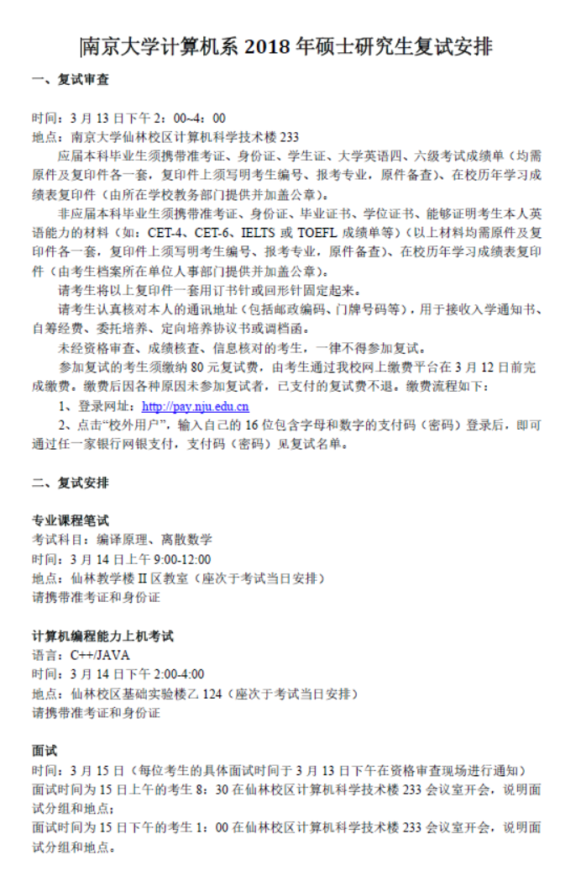

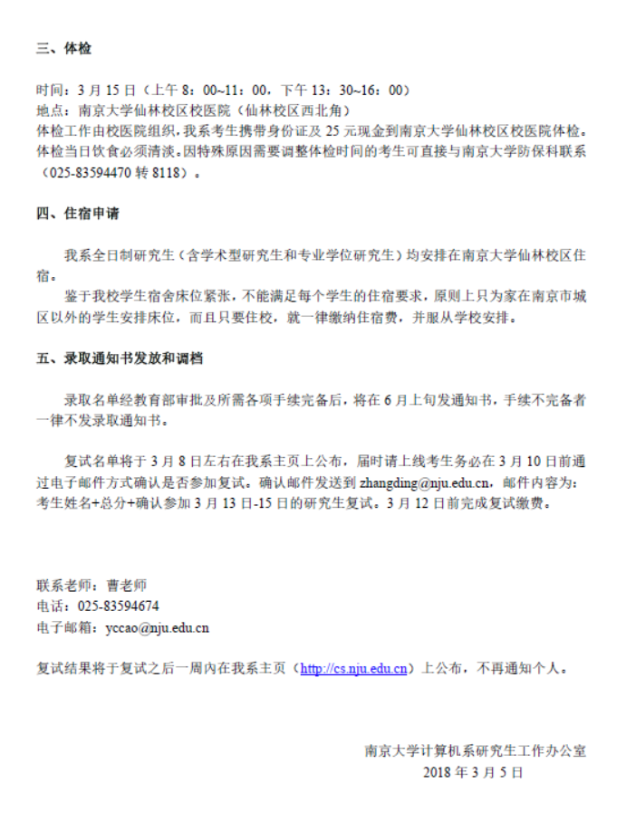

## 1.8. 仓库内容

### 1.8.1. 录取信息

包含报录比、拟录取名单、分数线、基本分数线

### 1.8.2. 初试

初试相关的资料（真题、PPT、期末考试）

包括政治、英语一、数学一、算法、数据结构、计算机组成原理、计算机网络、操作系统、初试需要的课本PDF及配套资料（PPT和课后习题参考答案等）、天勤和王道每年发布的复习资料（2021版，王道2021版的操作系统暂时没有找到）

***所谓的数据结构1800题，其实是由机械工业出版社出版的《算法与数据结构 考研试题精析》 陈守孔 胡潇琨 李玲编著。在淘宝可以买到第四版或者第三版。本仓库中的文档根据内容判断，应该是第二版或者更早的第一版的。***

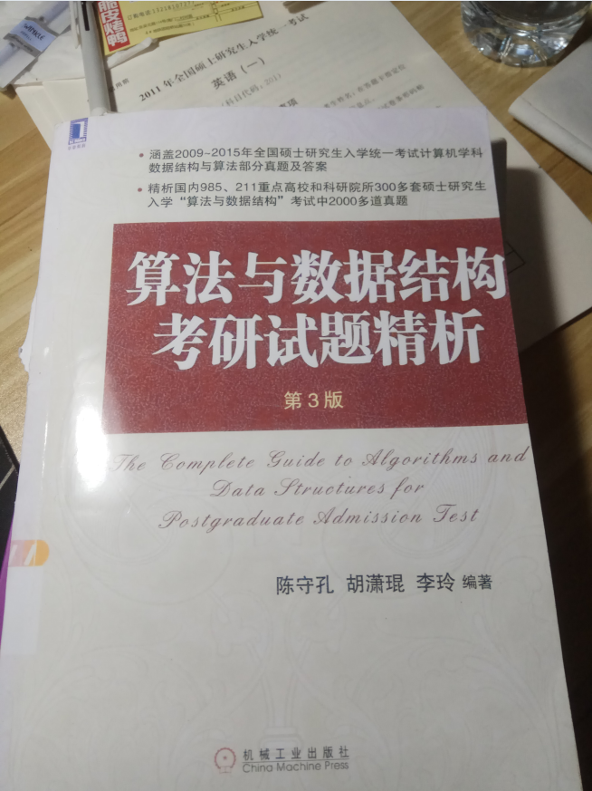

### 1.8.3. 复试

复试相关资料

包括复试经验、英语听力、离散数学、编译原理、上机题目、面试要求、口语资料

### 1.8.4. img

本说明文档的图片存在我个人博客的CDN服务器中。

## 1.9. 考研科目细节

***从群里搞到的新版参考书目，来源未知***

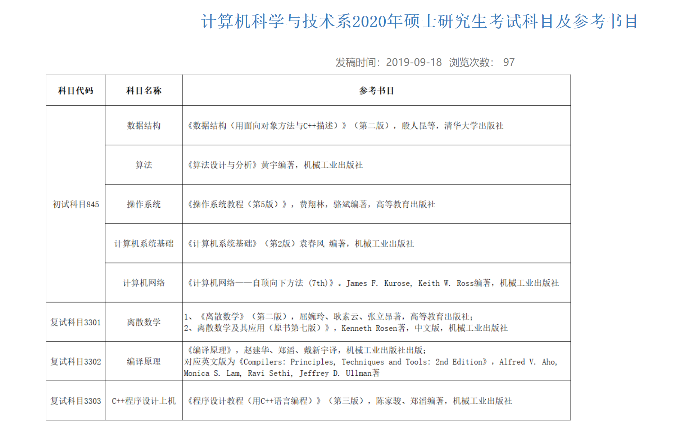

这是个845的，408的统考官方并没有给出参考书目。

### 1.9.1. 初试

#### 1.9.1.1. 数学一

***划重点：不推荐张宇 你要是头铁另说***

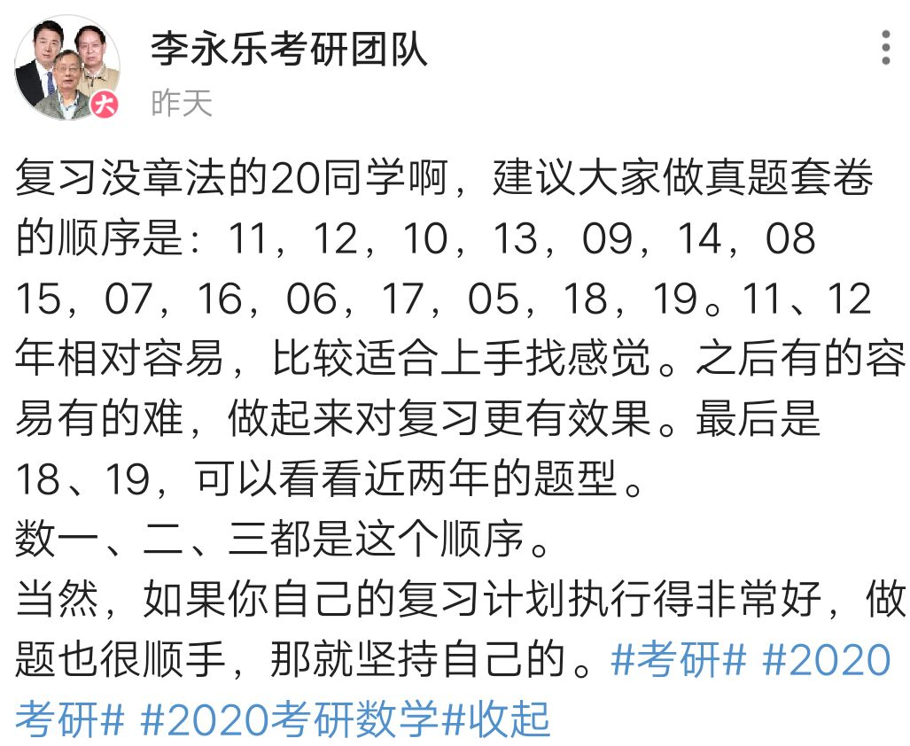

#### 1.9.1.2. 英语一

单词是最重要的，你不了解文章的大意会再多的解题技巧都没有用。

当然了，以后看论文也方便。

<a href="https://feater.top/data/the-anlysis-of-postgraduate-examination-data">2005-2020考研英语真题数据分析报告</a>

#### 1.9.1.3. 政治

参考资料不用说了，肖大爷是你唯一的依靠

但是，如果你平时有空，推荐小程序刷刷选择题

#### 1.9.1.4. 《数据结构（用面向对象方法与C++描述）》（第二版），殷人昆等，清华大学出版社

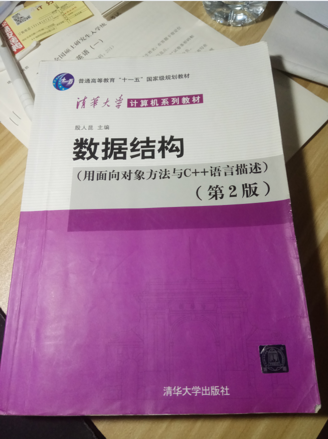

***带星号的一般不会考***

重点关注线性表、树、图、排序算法（时间/空间）、AVL树、B树

视频：

<a href="https://www.bilibili.com/video/av23317136?p=1">数据结构与算法</a>

<a href="https://www.bilibili.com/video/av38920216/">西北大学 - 数据结构 （国家级精品课，好课啊，推荐）</a>

课后习题参考答案还没有整理.

殷人昆版数据结构的PDF文档太难找,而我又不想买实体书,所以数据结构部分的参考书目为<数据结构(C++语言)>(第三版) 邓俊辉编著.并制作此书的课后习题参考答案.

#### 1.9.1.5. 《算法设计与分析(第二版)》黄宇，机械工业出版社

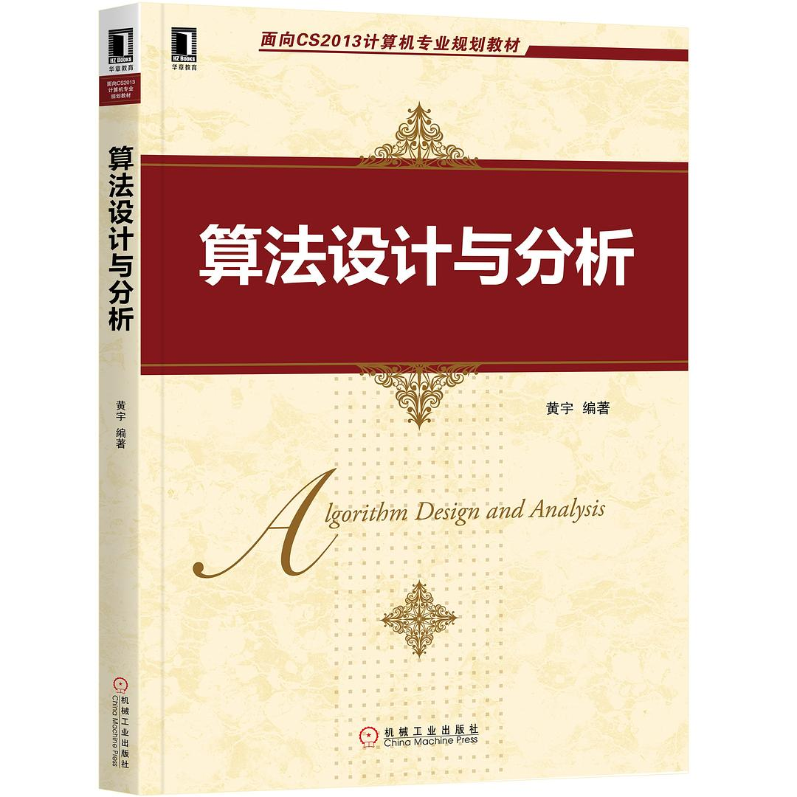

黄宇是南大教这门课的。

黄宇老师在B站上传了视频，同时在知乎发布声明不会提供参考答案。

<a ref="https://www.bilibili.com/video/BV11341167sn">B站-战疫时期的算法课-南京大学-2020年春季</a>

并且也会在之后更新勘误，同时在知乎发布文章表示不会写参考答案。

重点动态规划、DP问题（背包/换硬币/跳台阶） ***主要是复试上机***

剑指offer

视频：

<a href="https://www.bilibili.com/video/av64662783/">北京大学-算法设计与分析（国家级精品课）</a>

课后习题参考答案暂时还没有整理.

#### 1.9.1.6. 《操作系统教程（第5版）》费翔林、骆斌编著，高等教育出版社

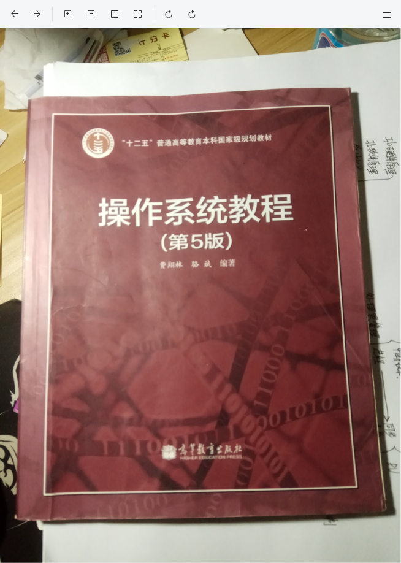

重点包括：中断、内存管理、PV操作（N生产者N消费者/共浴/理发师）

视频：

<a href="https://www.icourse163.org/course/NJU-1001571004">计算机操作系统</a>

课后习题参考答案暂时还没有整理.

#### 1.9.1.7. 计算机组成原理

南京大学的计算机组成原理也是袁春风教的。

#### 1.9.1.8. 《计算机网络——自顶向下方法 (7th)》James F. Kurose, Keith W. Ross编著，机械工业出版社

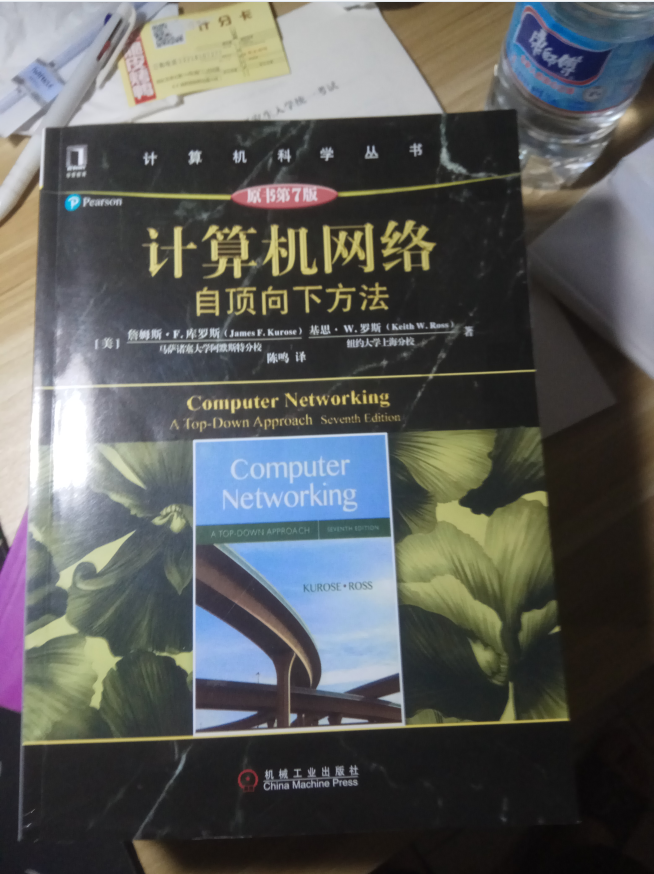

重点：应用层（http）、传输层（TCP）、网络层（IpV4及相关协议）、链路层（以太网）、SSL

视频：

<a href="https://www.bilibili.com/video/av41404195">计算机网络（自顶向下方法）</a>

<a href="https://www.bilibili.com/video/av58999844">国防科技大学-计算机网络（国家级精品课）</a>

PDF资料和中文版参考答案在：<a href="https://feater.top/book/collections-of-compute-network-top-down-methond">CN</a>

版本号：V2020.12.31

提醒，参考答案只是翻译完成并且修复了公式导出问题，内容并没有校正。使用的时候注意一点。

### 1.9.2. 复试

复试资料还没有收集，这个原来的

#### 1.9.2.1. 《离散数学（第2版）》屈婉玲，高等教育出版社

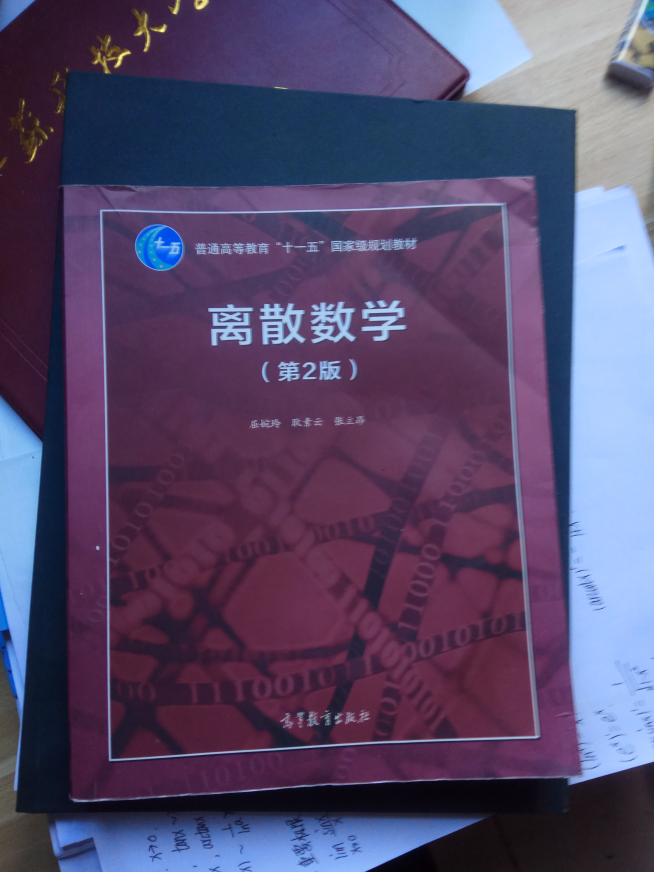

逻辑、计数计术、群论、图论、边收缩、非降路径

视频：

<a href="https://www.bilibili.com/video/av66617565?p=1">北京大学-离散数学（国家级精品课）</a>

<a href="https://www.bilibili.com/video/av59326261/">吉林大学-离散数学（国家级精品课）</a>

<a href="https://www.icourse163.org/course/USTB-1206407811">离散数学</a>

课后习题参考答案还没有整理.

#### 1.9.2.2. 《离散数学及其应用（原书第6版）》Rosen，机械工业出版社

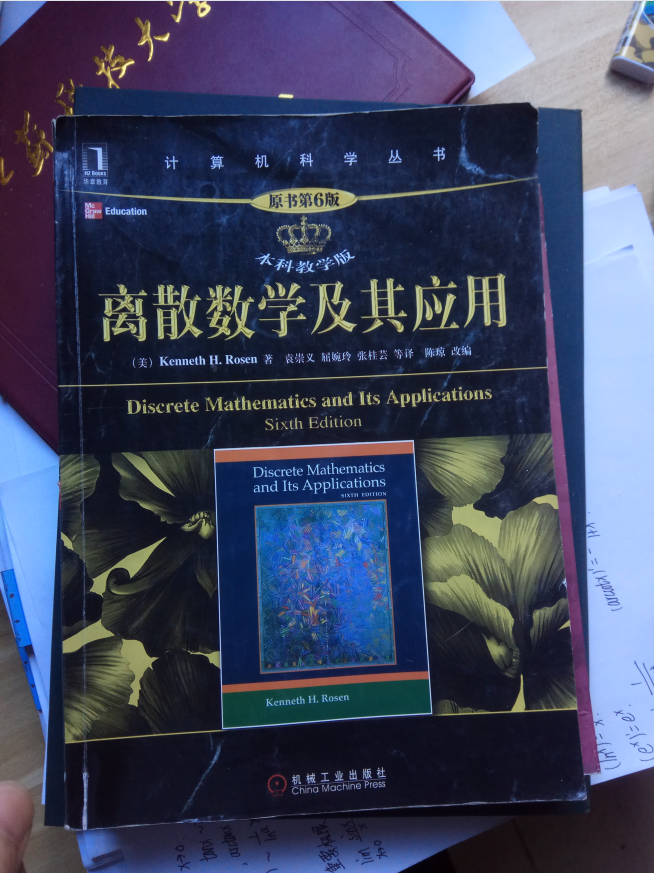

课后习题参考答案还没有整理.

#### 1.9.2.3. 《程序设计教程 用C++语言描述》陈家俊，机械工业出版社

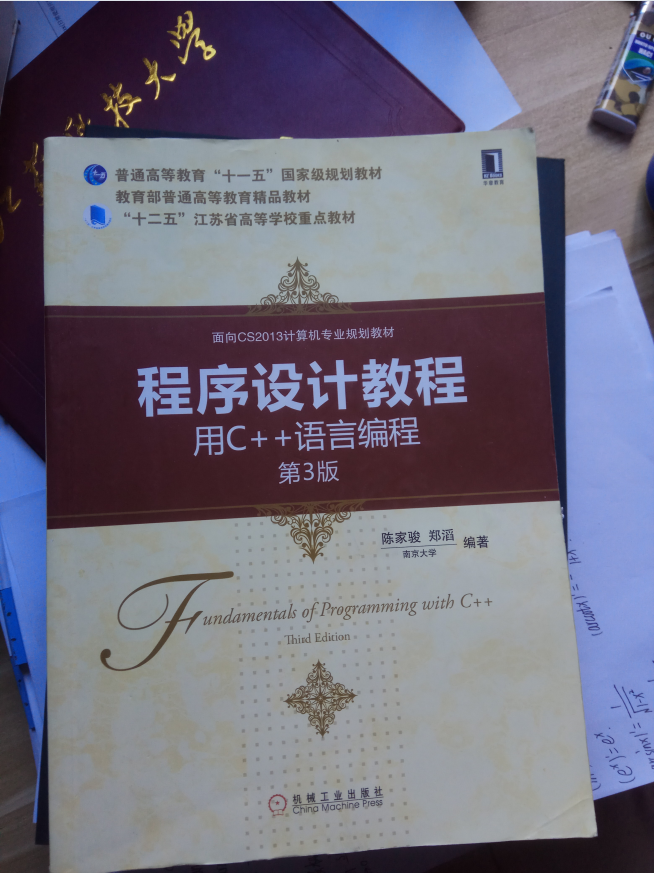

课后习题参考答案还没有整理.

#### 1.9.2.4. 《编译原理》（又名龙书），机械工业出版社；

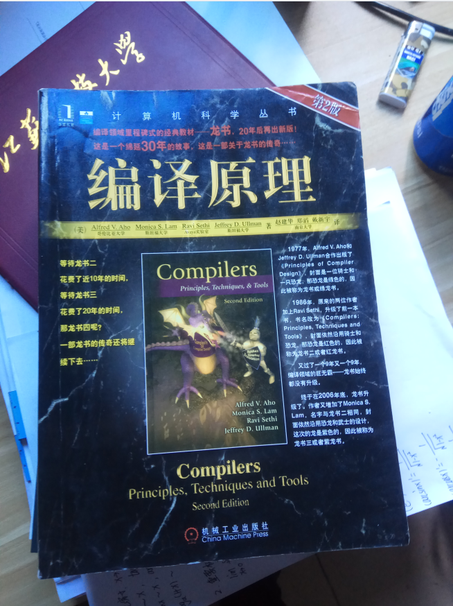

DFA-NFA、LL分析法、LR分析法、SDD-SDT、翻译、回填

***PPT***

视频：

<a href="https://www.bilibili.com/video/av17649289">编译原理（哈工大）</a>

课后习题参考答案还没有整理.

## 1.10. 其他资料

## 1.11. 南京大学概况

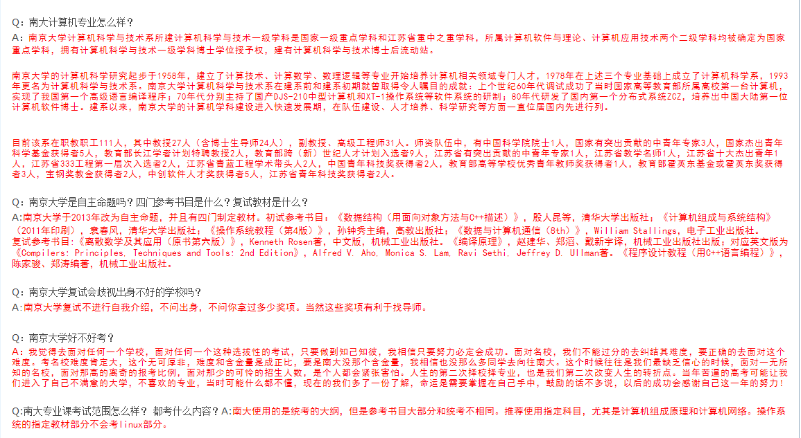</img>

### 1.11.1. 本科课表

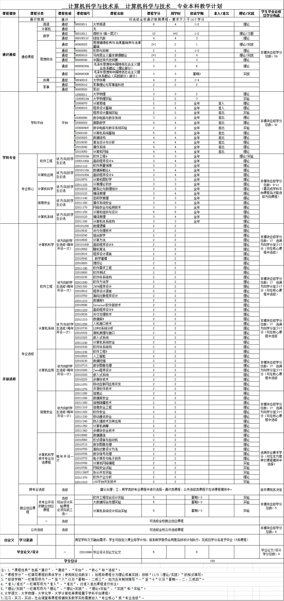

### 1.11.2. 硕士研究生课表

待补充

### 1.11.3. 路线-地铁

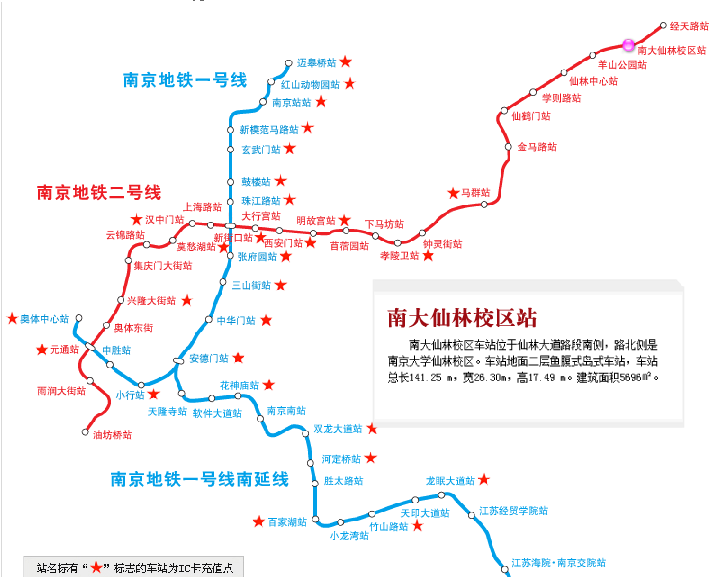

### 1.11.4. 南大仙林校区介绍

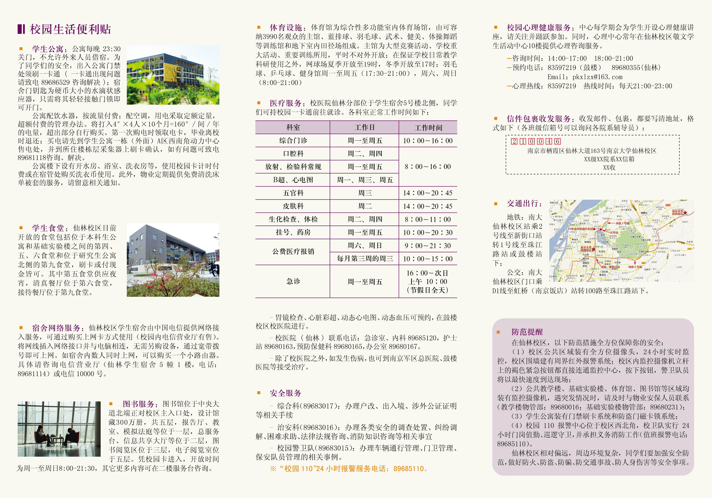

### 1.11.5. 南大仙林校区地图

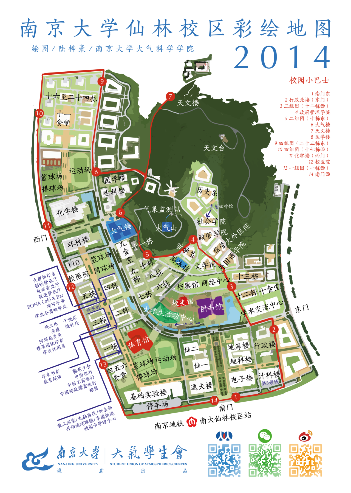

### 1.11.6. 校车班车列表

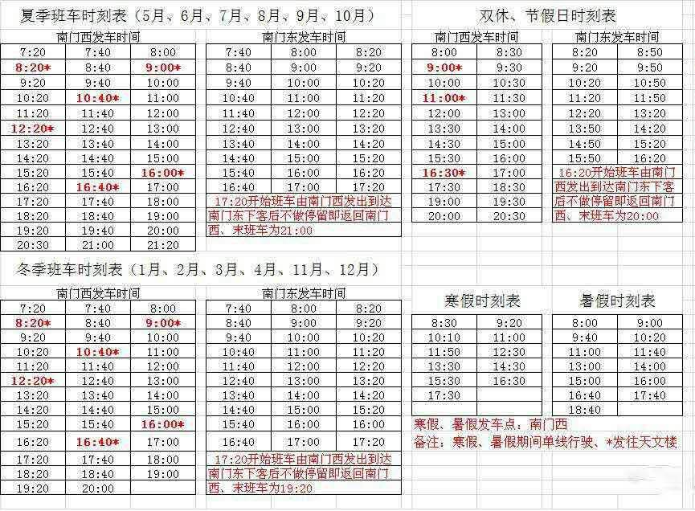

### 1.11.7. 南大机构电话

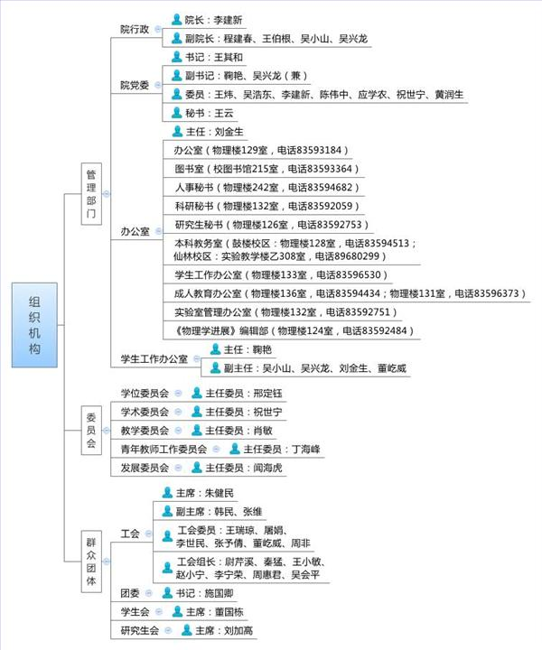

## 1.12. 参考资料

[1] https://cs.nju.edu.cn/lwz/algorithm/

[2] https://cs.nju.edu.cn/algorithm/slides.html

[3] https://blog.csdn.net/huang1024rui/article/details/49154507

[4] 思维导图.https://github.com/SSHeRun/CS-Xmind-Note

[5] 计算机网络：自顶向下第七版 英文版PPT http://www-net.cs.umass.edu/kurose-ross-ppt-7e/ 

[6] 初试英语、数学资料是从新东方论坛盗来的 http://bbs.koolearn.com/forum.php?mod=viewthread&tid=5664088&extra=&page=1

[7]<a href="https://github.com/xiaolei565/aimto408">aimto408</a>（我从这个仓库盗了天勤的PDF文件）

## 1.13. 结束语

很幸运我们在此相会，感谢阁下对本资料库的厚爱

创建本仓库的目的是方便资料整合，同时交流。

但是到目前为止，全是白嫖的。

到此为止，本仓库所有对你有价值的资料已经被你完全看完。

按照下载流程和复习（预习）流程好好看书吧。

同时也欢迎大家更新新版本的资料

切记：少玩手机，多看书，多刷题

如果资料过时或者其他问题建议欢迎提出来。

我，幽弥狂，打钱。


如果有空，可以到我的<a href="https://feater.top">个人博客</a>上面看看。

不定期分享Qt/Linux/OpenGL/OpenCV/FFmpeg/ROS2/C++文章，同时会分享一些电子书，以及破解软件等等。
